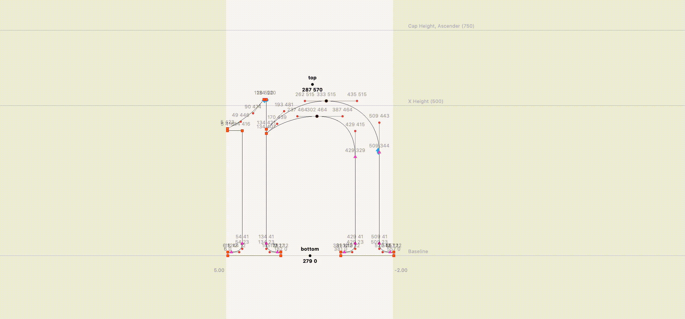
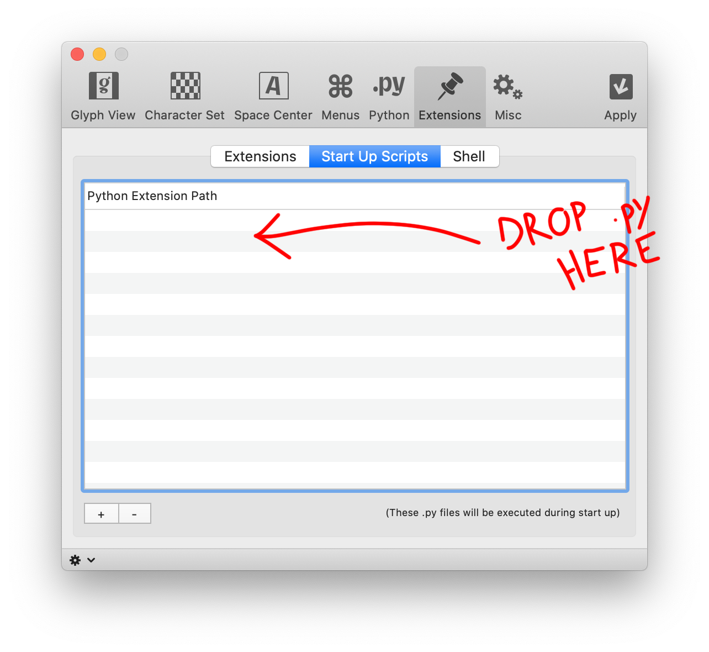

# Magnetic Metric

Observer to make sidebearings magnetic to outline modifications.  
Its aim to be used as a startup script so it can be activated and deactivated whenever you need.

If this doesn’t fit your need, maybe you’ll want to try Ryan Bugden and Bahman Eslami [take](https://github.com/ryanbugden/Margin-Selection) on it.

## Install

Drag and drop `magneticmargins.py` file in Robofont Start Up Scripts windows located in the sofware preferences.  
You will need to restart Robofont in order to complete installation.

## Usage
Press `shift + M` to activate the magnetic metrics.  
Press again `shift + M` to deactivate the magnetic metrics.  
For a live demo, please see the video located in this folder.

When activate, magnet icons will appear on your sidebearings.

## License
[MIT License](https://opensource.org/licenses/mit-license.php)

Permission is hereby granted, free of charge, to any person obtaining a copy of this software and associated documentation files (the "Software"), to deal in the Software without restriction, including without limitation the rights to use, copy, modify, merge, publish, distribute, sublicense, and/or sell copies of the Software, and to permit persons to whom the Software is furnished to do so, subject to the following conditions:

The above copyright notice and this permission notice shall be included in all copies or substantial portions of the Software.

THE SOFTWARE IS PROVIDED "AS IS", WITHOUT WARRANTY OF ANY KIND, EXPRESS OR IMPLIED, INCLUDING BUT NOT LIMITED TO THE WARRANTIES OF MERCHANTABILITY, FITNESS FOR A PARTICULAR PURPOSE AND NONINFRINGEMENT. IN NO EVENT SHALL THE AUTHORS OR COPYRIGHT HOLDERS BE LIABLE FOR ANY CLAIM, DAMAGES OR OTHER LIABILITY, WHETHER IN AN ACTION OF CONTRACT, TORT OR OTHERWISE, ARISING FROM, OUT OF OR IN CONNECTION WITH THE SOFTWARE OR THE USE OR OTHER DEALINGS IN THE SOFTWARE.

